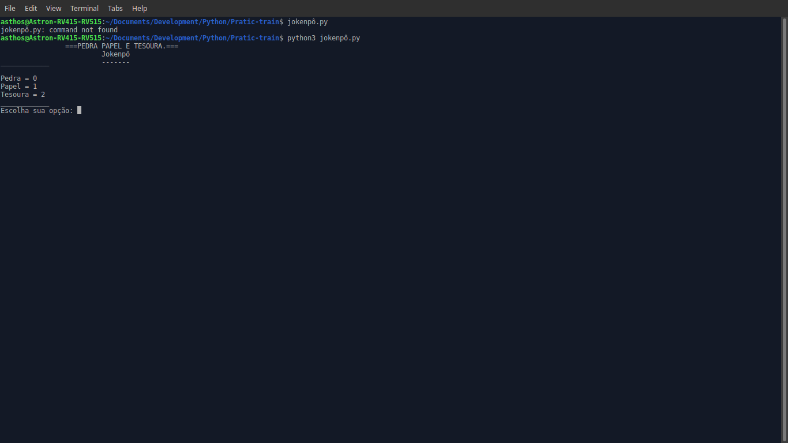

# JO-KEN-PÔ!!!
<h2>| Description |</h2>

basic. I make this game only for train. This is a good project to train your logic game with python language. This game is very simple. It works basically with numbers, "ifs" and "elses". <b>WARNING:</b> is very likely that it has very errors in the code, "quick fixs" and very problems.

<h2>| Libraries and Modules |</h2>
<h3>Libs: Time and random </h3>
<h3>Modules: Sleep and randint</h3>

<h2>| Examples |</h2>
<h3>1.</h3>

<h3>2.</h3>

<h2>| Final explanation |</h2>

The program goes take your number and do a verification of "bot" value and your value, and print the result of the game, being that, the possible results is: You win, you lose, a tie and try again. I added some extra functions, but they is optionals. The randint is to take a whole number number between 0 and 3, the sleep is to add a delay to execute other instructions and the system is to use "clear" and with this, remove the terminal contents ( This function is misplaced. I will fix this error ) 

